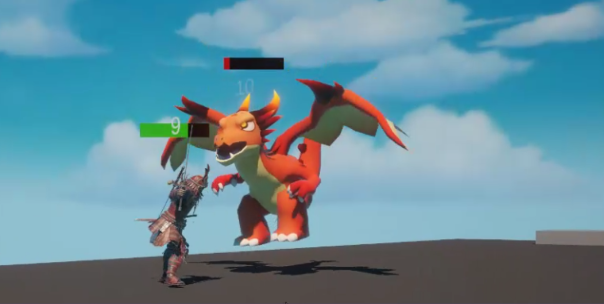
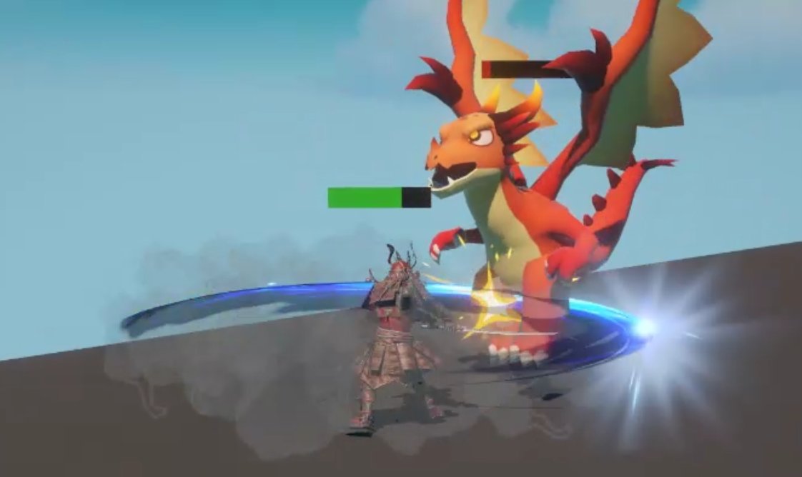
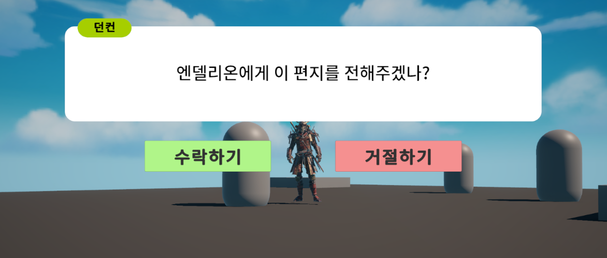

# 🗡️ Project MMORPG

> Unity 기반 MMORPG 포트폴리오 프로젝트  
> 마비노기 모바일을 레퍼런스로, **응집도 ↑ / 결합도 ↓** 를 핵심 설계 목표로 삼아 구조를 직접 탐구하고 적용한 프로젝트입니다.

---

## 📌 프로젝트 개요

| 항목 | 내용 |
|------|------|
| 엔진 | Unity 2022 LTS |
| 언어 | C# |
| 렌더 파이프라인 | URP |
| 레퍼런스 | 마비노기 모바일 |

단순한 기능 구현에 그치지 않고, **"왜 이 구조를 선택했는가"** 를 스스로 질문하며 설계 결정을 내린 프로젝트입니다.  
ScriptableObject를 통한 데이터 관리, Pipeline 패턴 기반 전투 처리, EventBus 기반 퀘스트 진행 등 실무에서 쓰이는 아키텍처 패턴을 직접 고민하고 적용했습니다.

🎮 스크린샷
<p align="center">
  
  
</p>
<p align="center">
  
</p>
---

## 🏗️ 레이어 아키텍처

의존 방향을 단방향으로 강제하기 위해 **Assembly Definition** 으로 세 레이어를 분리했습니다.  
역방향 참조는 컴파일 단계에서 원천 차단됩니다.

```
Core  ←  Data  ←  Game
```

| 레이어 | 역할 | 외부 의존 |
|--------|------|-----------|
| `MMORPG.Core` | 인터페이스, Enum, 이벤트 정의만 포함. 구현 코드 없음 | 없음 |
| `MMORPG.Data` | ScriptableObject 데이터 컨테이너. 로직 없음 | Core만 |
| `MMORPG.Game` | 실제 게임 로직 구현 | Core + Data |

이 구조 덕분에 Data 레이어의 SO를 수정해도 Game 레이어에만 영향이 국한되며,  
Core의 인터페이스를 변경하면 컴파일러가 즉시 깨진 구현부를 알려줍니다.

---

## 📦 ScriptableObject로 데이터 관리하기

MMORPG는 몬스터, 스킬, 퀘스트, NPC, 대화 등 **수십~수백 개의 데이터**가 존재합니다.  
이를 하드코딩하거나 MonoBehaviour에 직접 박아두면 유지보수가 불가능해집니다.

### SO vs JSON 분리 원칙

| 구분 | 저장 방식 | 예시 |
|------|-----------|------|
| 불변 정의 데이터 | ScriptableObject | 퀘스트 제목, NPC 이름, 스킬 수치 |
| 런타임 상태 데이터 | JSON (Addressables) | 퀘스트 진행 상태, 현재 킬 카운트 |

> SO는 에디터에서 편집, JSON은 세이브/로드 및 서버 동기화 대상.  
> **SO에 런타임 상태를 저장하지 않는다** 가 핵심 원칙입니다.

### 주요 ScriptableObject

- **`PlayerSO`** — moveSpeed, maxHp, attackPower, attackRange, 스킬 목록
- **`SkillSO`** — skillId, skillType, damage, cooldown, range, 이펙트 Prefab
- **`QuestSO`** — 퀘스트 정의, 선행 퀘스트, 보상, 수락/완료 대화
- **`NPCSO`** — NPC 정보, 초기 대화, 수주 가능한 퀘스트 목록
- **`DialogueSO`** — 대화 노드 체인 (퀘스트 상태에 따라 분기)

---

## ⚔️ 전투 파이프라인 (Pipeline Pattern)

전투 데미지 처리를 **단일 함수에 몰아넣으면** 명중 판정, 크리티컬, 방어력, 실드를 모두 `if`로 처리하게 되어 수정이 두려워집니다.  
이를 해결하기 위해 **Pipeline 패턴**을 도입했습니다.

### 데미지 흐름

```
AttackRequest
    │
    ▼
[1. HitCheckProcessor]         → 명중 / 회피 판정
    │
    ▼
[2. CriticalCheckProcessor]    → 크리티컬 판정
    │
    ▼
[3. DamageCalculateProcessor]  → 기본 데미지 + 속성 저항
    │
    ▼
[4. MitigationProcessor]       → 방어력 적용 (True 피해는 무시)
    │
    ▼
[5. ShieldProcessor]           → 실드 처리
    │
    ▼
[6. HealthReduceProcessor]     → 실제 HP 차감
    │
    ▼
[7. EventDispatchProcessor]    → EventBus로 결과 발행
```

각 단계는 `IDamageProcessor` 인터페이스를 구현하며, `DamageContext` 객체를 통해 데이터를 넘깁니다.  
`ctx.IsCancelled = true` 로 파이프라인을 중단할 수 있어, 예를 들어 빗나갔을 때 이후 단계를 건너뜁니다.

**이 구조의 장점:**
- 새로운 효과(흡혈, 반사 등)를 Processor 하나만 추가해 끼워 넣을 수 있습니다
- 각 단계를 독립적으로 테스트할 수 있습니다
- 기존 로직을 건드리지 않고 순서 변경/단계 추가/제거가 가능합니다

---

## 📬 퀘스트 이벤트 버스 (Event Bus Pattern)

퀘스트 시스템이 전투/인벤토리/대화 시스템을 직접 참조하면 **강한 결합**이 생깁니다.  
몬스터가 죽을 때 `QuestManager.AddProgress()` 를 직접 호출하는 구조는 Combat이 Quest를 알아야 하므로 레이어 원칙을 위반합니다.

### 해결: Event Bus로 결합 끊기

```
CombatSystem ──OnMonsterDead──▶ QuestEventListener ──▶ GameEventPublisher ──▶ GameEventBus
                                                                                    │
                                                                               QuestManager (구독)
```

- **도메인 시스템(Combat, Inventory, Dialogue)은 Quest를 전혀 모릅니다**
- `QuestEventListener` 하나가 도메인 이벤트를 구독해 `GameEventPublisher`로 중계합니다
- `QuestManager`는 `GameEventBus`를 구독해 조건 충족 여부를 판단합니다

### 이벤트 타입

```csharp
public enum GameEventType
{
    MonsterKilled,
    ItemCollected,
    NpcTalked,
    ItemUsed,
    QuestCompleted
}
```

발행은 반드시 `GameEventPublisher`를 통해서만 이루어지며, 이를 통해 발행 지점을 한 곳에 집중시키고 디버그 로그도 일원화했습니다.

---

## 🗂️ 프로젝트 구조

```
Assets/
└── 02.Scripts/
    ├── Core/           # 인터페이스, Enum (의존 없음)
    │   ├── IDamageable.cs
    │   ├── IInteractable.cs
    │   └── IQuestTarget.cs
    ├── Data/           # ScriptableObject (Core만 참조)
    │   ├── PlayerSO.cs
    │   ├── SkillSO.cs
    │   ├── QuestSO.cs
    │   ├── NPCSO.cs
    │   └── DialogueSO.cs
    └── Game/           # 게임 로직 (Core + Data 참조)
        ├── Combat/
        │   ├── DamagePipeline.cs
        │   ├── DamageContext.cs
        │   └── Processors/
        ├── Quest/
        │   ├── QuestManager.cs
        │   ├── GameEventBus.cs
        │   ├── GameEventPublisher.cs
        │   └── QuestEventListener.cs
        ├── Dialogue/
        │   └── DialogueSystem.cs
        └── UI/
            └── QuestTrackerUI.cs
```

---

## 💡 설계 과정에서 고민한 것들

**"QuestManager가 직접 Monster 이벤트를 받으면 안 될까?"**  
그러면 QuestManager가 CombatSystem을 알아야 하고, 레이어 의존이 역전됩니다. → EventBus로 간접 연결.

**"전투 로직을 하나의 함수에 다 넣으면?"**  
조건이 늘어날수록 수정 범위를 예측할 수 없어집니다. → Pipeline으로 단계 분리.

---

## 📎 참고 문서

- [step-combat_pipeline.md](./step-combat_pipeline.md) — 전투 파이프라인 설계 명세
- [step-quest_eventbus.md](./step-quest_eventbus.md) — 퀘스트 이벤트 버스 설계 명세
- [step-player-fsm.md](./step-player-fsm.md) — 플레이어 FSM 설계 명세
- [step-npc-dialogue.md](./step-npc-dialogue.md) — NPC 대화 시스템 설계 명세
- [step-ui-manager.md](./step-ui-manager.md) — UI 매니저 설계 명세
